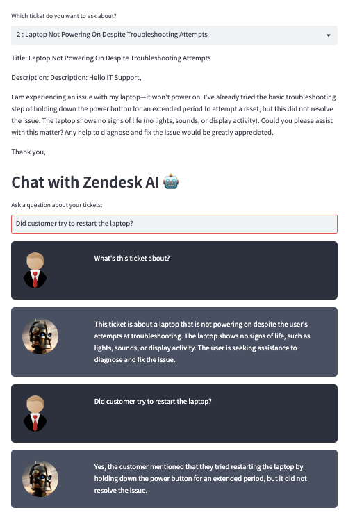

# zendesk-query-ai
This repository integrates the Zendesk API with OpenAI to fetch and display ticket data in a conversational UI. Users can select s ticket and interact directly with their contents, asking questions and getting AI-powered responses.



# Requirements

Ensure you have Python 3.6+ installed on your system.

## Setup

### Clone the Project

First, clone the repository to your local machine:

```bash
git clone https://github.com/chaichatchai13/zendesk-query-ai.git
cd zendesk-query-ai
```

## Install Dependencies
Install the required Python dependencies by running:
```
pip3 install -r requirements.txt
```

## Environment Variables
**Create a new .env file and copy the content from .env.example (don’t forget to put your own OPENAI_API_KEY and Zendesk subdomain, username, and password)**

## Running the Application
To start the server, run the following command from the root of your project directory:
```
streamlit run app.py
```